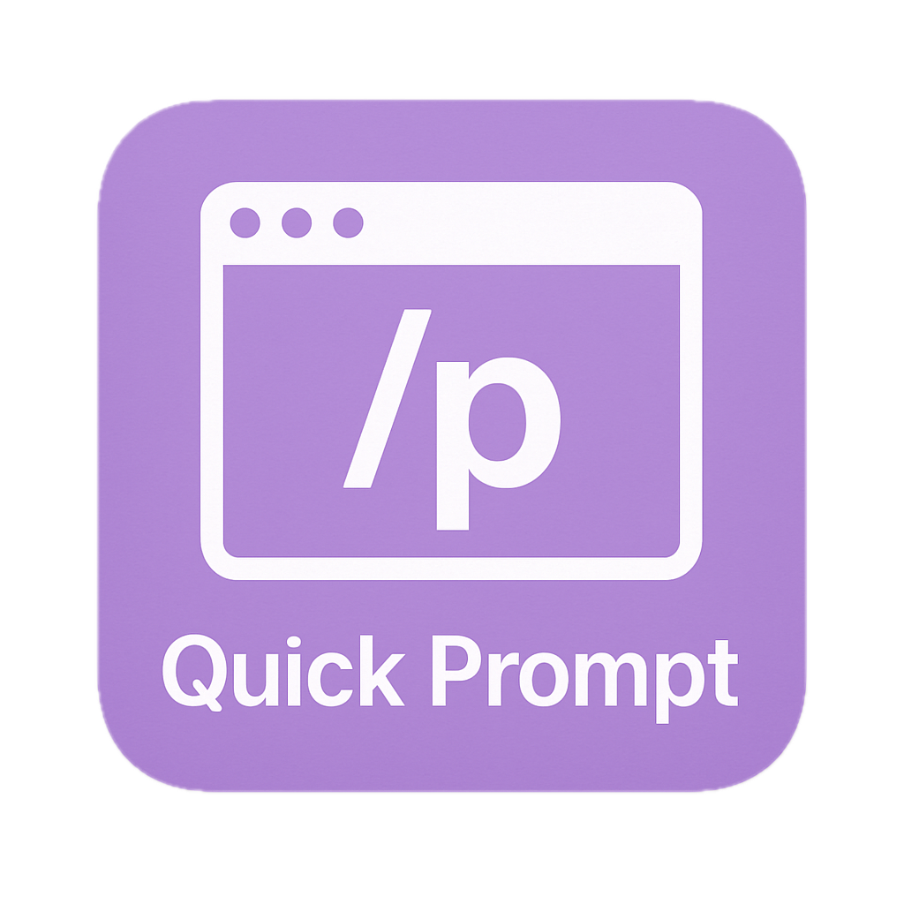

# Quick Prompt

[English](./README_en.md) | 中文

<p align="center">
  
</p>

一个强大的浏览器扩展，专注于提示词管理与快速输入。帮助用户创建、管理和组织提示词库，并在任何网页输入框中快速插入预设的 Prompt 内容，提高工作效率。

> 由于浏览器插件只能用于网页端，因此开源了一个功能相同的 [Raycast 插件](https://github.com/wenyuanw/quick-prompt-raycast)，兼容浏览器插件数据格式，支持通过相同 JSON 数据无缝迁移。

## ✨ 功能特性

- 📚 **提示词管理**：便捷地创建、编辑和管理你的提示词库
- 🚀 **快速输入**：在任何网页输入框中通过 `/p` 快速触发提示词选择器
- ⌨️ 支持配置快捷键打开提示词选择器&保存选中文本为提示词
- 📑 支持右键菜单直接保存选中文本为提示词
- 🎯 支持自定义提示词，包括分类、标题、内容、标签和变量
- 🧑‍💻 **变量支持**：提示词中可以使用 `{{变量名}}` 格式的变量，使用时可以填写具体的值
- 💾 **数据备份**：支持提示词库的导出和导入，方便跨设备迁移和备份
- 🔗 **Notion 同步**：支持将提示词库与 Notion 数据库同步
- 🔍 支持搜索和过滤提示词功能
- 🌙 自动适应系统的明暗主题

## ⚠️ 已知问题

- 在豆包（doubao.com）网页中，使用`/p`触发提示词选择器后部分输入框会出现没有清除掉`/p`的问题。不过别担心，我和我的老搭档 Cursor 正在日以继夜地寻找解决方案，争取早日修复它！

## 🚀 使用方法

1. **快速触发**：在任何网页的文本输入框中输入 `/p` 以触发提示词选择器
2. **快捷键打开选择器**：使用 `Ctrl+Shift+P`（Windows/Linux）或 `Command+Shift+P`（macOS）打开提示词选择器
3. **选择提示词**：从弹出的选择器中点击所需的提示词，它将自动插入到当前输入框中
4. **快速保存提示词**：选中任意文本后，使用 `Ctrl+Shift+S`（Windows/Linux）或 `Command+Shift+S`（macOS）快速保存为提示词
5. **右键菜单保存**：选中任意文本后，右键点击并选择"保存该提示词"，将选中内容保存为提示词
6. **导出提示词库**：在管理页面点击"导出"按钮，将所有提示词导出为JSON文件保存到本地
7. **导入提示词库**：在管理页面点击"导入"按钮，从本地JSON文件中导入提示词（支持合并或覆盖现有提示词）

## 📸 界面预览

Quick Prompt 提供直观友好的用户界面，让你轻松管理和使用提示词。

### 提示词选择器


使用 `/p` 快捷指令或快捷键可以在任何输入框中快速调出提示词选择器，让你方便地挑选并插入需要的提示词。

### 提示词管理页面


在管理页面中，你可以创建新的提示词、编辑现有提示词、添加标签以及进行分类管理。界面简洁明了，操作便捷。

### 右键菜单保存


只需选中网页中的任何文本，右键点击即可将其快速保存为提示词，提高工作效率。

### 提示词变量输入


提示词支持配置变量，选取之后弹窗输入相应变量值。

## ⚙️ 自定义配置

1. 点击扩展图标，然后点击"管理提示词"按钮
2. 在管理页面，你可以:
   - 添加新的提示词
   - 编辑现有提示词
   - 删除不需要的提示词
   - 为提示词添加标签进行分类
   - 导出提示词库进行备份
   - 导入之前备份的提示词库

## 📦 安装指南

### 从应用商店安装

现已上线Chrome应用商店！[点击此处下载安装](https://chromewebstore.google.com/detail/quick-prompt/hnjamiaoicaepbkhdoknhhcedjdocpkd)

### 从 GitHub Releases 获取

1. 访问 [GitHub Releases 页面](https://github.com/wenyuanw/quick-prompt/releases)
2. 下载最新版本的构建好的插件包
3. 解压下载的文件
4. 按照下方的说明安装已构建的扩展

### 从源码构建

1. 克隆仓库
   ```bash
   git clone https://github.com/wenyuanw/quick-prompt.git
   cd quick-prompt
   ```
2. 安装依赖
   ```bash
   pnpm install
   ```

3. 开发和构建
   ```bash
   # 开发模式 (Chrome)
   pnpm dev
   
   # 开发模式 (Firefox)
   pnpm dev:firefox
   
   # 构建扩展 (Chrome)
   pnpm build
   
   # 构建扩展 (Firefox)
   pnpm build:firefox
   ```

### 安装已构建的扩展

#### Chrome / Edge
1. 打开扩展管理页面 (`chrome://extensions` 或 `edge://extensions`)
2. 启用"开发者模式"
3. 点击"加载已解压的扩展"
4. 选择项目的 `.output/chrome-mv3/` 目录

#### Firefox
1. 打开 `about:debugging`
2. 点击"此 Firefox"
3. 点击"临时加载附加组件"
4. 选择项目的 `.output/firefox-mv2/` 目录中的 `manifest.json` 文件

## 📄 许可证

MIT

## 🤝 贡献指南

欢迎提交 Pull Requests 和 Issues！

1. Fork 这个仓库
2. 创建你的功能分支 (`git checkout -b feature/amazing-feature`)
3. 提交你的更改 (`git commit -m 'Add some amazing feature'`)
4. 推送到分支 (`git push origin feature/amazing-feature`)
5. 打开一个 Pull Request

## Star History

[](https://www.star-history.com/#wenyuanw/quick-prompt&Date)
